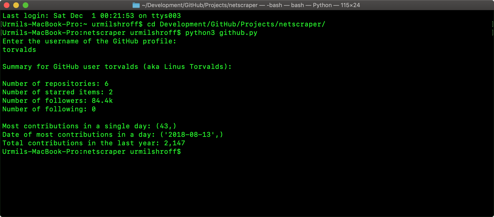

# WebScraper

A collection of BeautifulSoup 4 scraper programs in Python 3 to find info about things on the Internet through the command line, which is obviosuly very necessary to continue the existence of the human race.

## Screenshots
GitHub scraper:

Twitter scraper:

