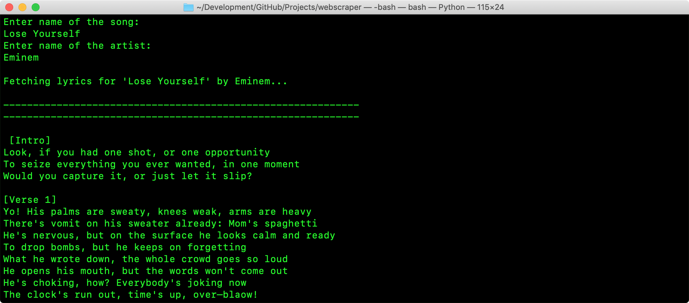

# WebScraper
A collection of BeautifulSoup 4 scraper programs in Python 3 to find info about shit on the Internet through the command line.

### Installing
Install Python 3 on your machine, then run `pip install -r requirements.txt` to install all the dependencies.

### Running
You can run any of the various Python files by using `python [filename].py`.

### Screenshots
Lyrics finder:

Twitter scraper:
